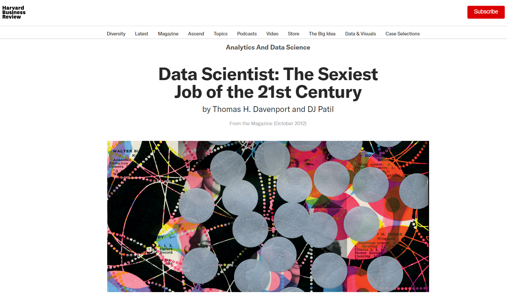
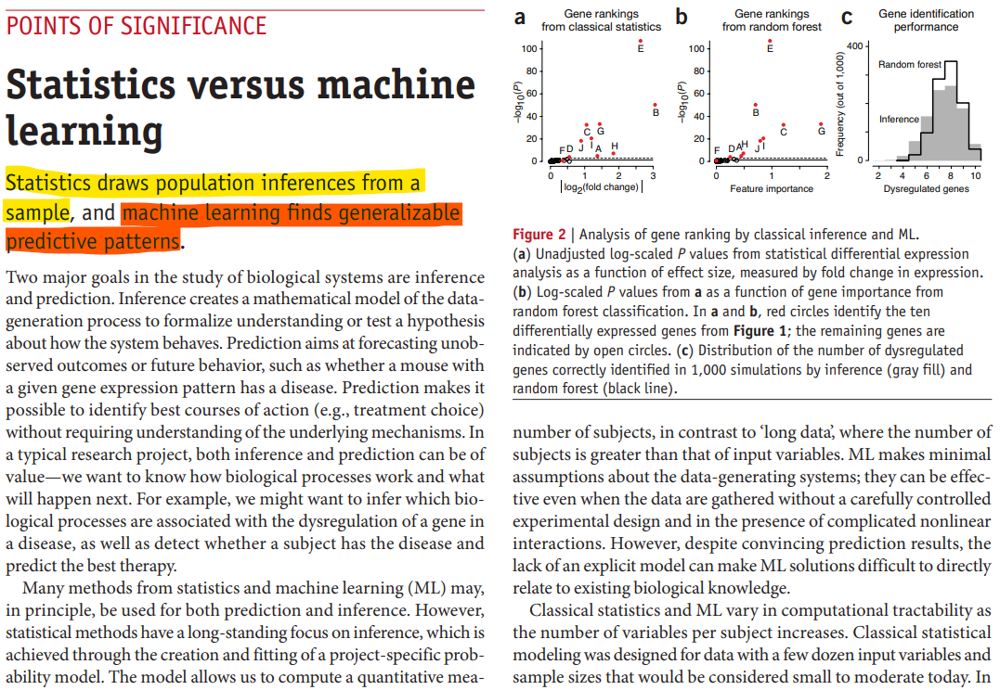
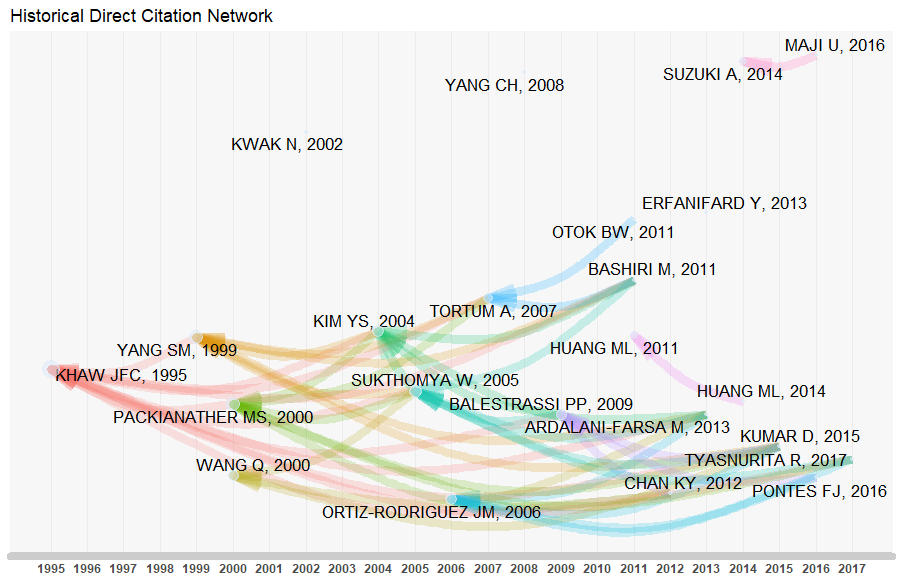
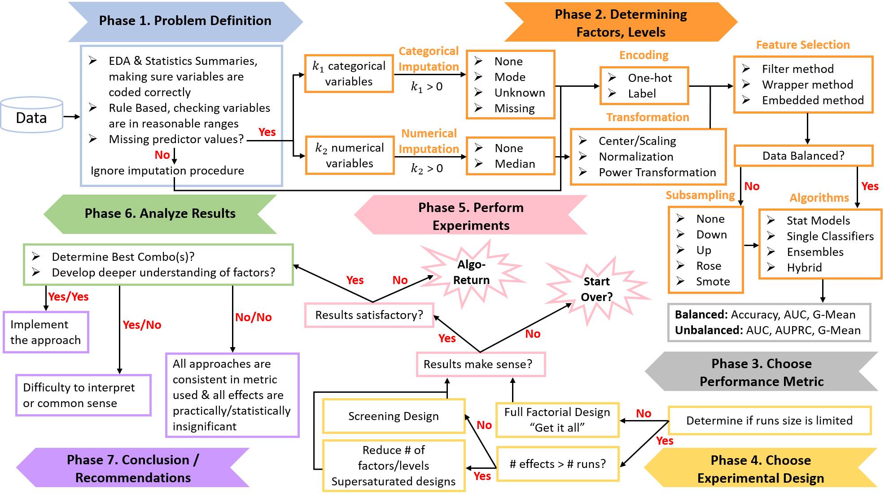
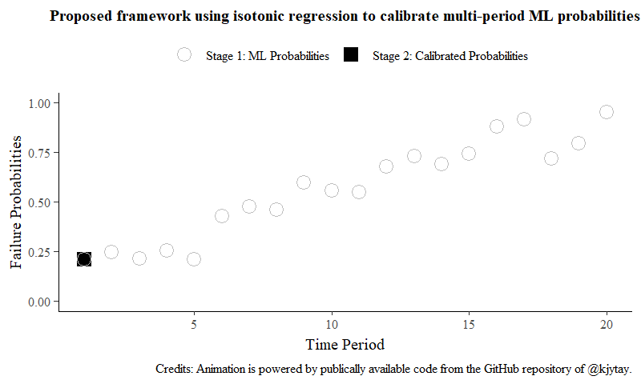
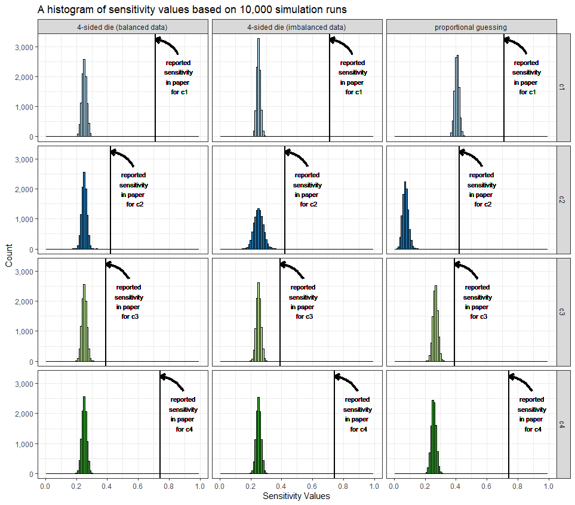

```{r setup, include=FALSE}
knitr::opts_chunk$set(cache = TRUE,
                      echo = FALSE,
                      warning = FALSE,
                      message = FALSE,
                      progress = FALSE, 
                      verbose = FALSE,
                      dev = 'png',
                      fig.height = 3,
                      dpi = 300,
                      fig.align = 'center')

options(htmltools.dir.version = FALSE)

miamired = '#C3142D'

if(require(pacman)==FALSE) install.packages("pacman")
if(require(devtools)==FALSE) install.packages("devtools")

if(require(countdown)==FALSE) devtools::install_github("gadenbuie/countdown")
if(require(xaringanExtra)==FALSE) devtools::install_github("gadenbuie/xaringanExtra")

if(require(icons)==FALSE) remotes::install_github("mitchelloharawild/icons")


pacman::p_load(tidyverse, magrittr, lubridate, janitor, # data analysis pkgs
               DT, # for nicely printed output
               fontawesome, RefManageR, xaringanExtra, countdown, icons,
               webshot, gifski,
               bibliometrix)
```

```{r xaringan-themer, include=FALSE, warning=FALSE}
if(require(xaringanthemer) == FALSE) install.packages("xaringanthemer")
library(xaringanthemer)

style_mono_accent(base_color = "#84d6d3",
                  base_font_size = "20px")

xaringanExtra::use_xaringan_extra(c("tile_view", "panelset", "broadcast", "share_again", "search", "fit_screen", "clipable", "clipboard"))
```


# Varian's Famous Prediction for Statistics Jobs

.pull-left[
> **...** the sexy job in the next ten years will be **statisticians** **...**

> The ability to **take data** – to be able to **understand** it, to **process** it, to **extract value** from it, to **visualize** it, to **communicate** it’s going to be a hugely important skill in the next decades **...** 

> I think **statisticians are part of it, but it’s just a part ...** -- Hal Varian, 2009
]


.pull-right[
```{r hal_varian, fig.alt='A photo of Hal Varian'}
knitr::include_graphics("https://upload.wikimedia.org/wikipedia/commons/thumb/2/26/Hal_Varian.jpg/1280px-Hal_Varian.jpg")
```
.center[**A quote from Hal Varian, Chief Economist at Google, in a January 2009 Interview with McKinsey Quarterly**]
]

.footnote[
<html>
<hr>
</html>
.bold[.blue[With hindsight being 20/20 (6/6 in Europe), how well did this prediction fare? ]]
]


---

# The Sexiest Job of the 21st Century? 

```{r hbr_data_science, out.width='75%', fig.alt='The coverpage of the Harvard Business Review article titled "Data Scientist: The Sexiest Job of the 21st Century" by Thomas Davenport and DJ Patil'}

```

.footnote[
<html>
<hr> 
</html>

**Source:** Davenport, T. H., & Patil, DJ. (2012). Data Scientist: The Sexiest Job of the 21st Century. Harvard Business Review, October Issue [[Article Link](https://hbr.org/2012/10/data-scientist-the-sexiest-job-of-the-21st-century)].

]


---

# Glassdoor's U.S. Labor Market Surveys

```{r glassdoor, include=FALSE}
urls = c(
  paste0("https://www.glassdoor.com/List/Best-Jobs-in-America-",
         2015:2021, "-LST_KQ0,20.htm"),
  # 2022 does not have 2022 in the
  "https://www.glassdoor.com/List/Best-Jobs-in-America-LST_KQ0,20.htm")

webshot(urls, cliprect = c(0, 0, 1000, 1150),
        useragent = 'Chrome/102.0.0.0 Safari/537.36',
        file = 'imgs/webshot.png')

webshot_figs = list.files(path = "imgs/", pattern = 'webshot', full.names = T)

gifski(webshot_figs, gif_file = "imgs/webshot_animation.gif", 
       width = 1600, height = 1840, delay = 5)

```

```{r glassdoor_gif, out.width='42%', fig.alt='An animated gif highlighting the prominence of data science as one of the top jobs in the U.S. between 2015 and 2022" title="Data scientist is a top 3 job in the U.S.'}

```


---

# Statistics vs Machine Learning/ Data Science

```{r stats_vs_ml, fig.cap='A controversial definition of both statistics and machine learning', out.width='60%'}

```

.footnote[
<html>
<hr> 
</html>

**Source:** Bzdok, D., Altman, N., & Krzywinski, M. (2018). Statistics versus machine learning. Nature Methods, 15(4), 233-234 [[Paper Link](https://www.nature.com/articles/nmeth.4642.pdf)].

]

---
count: false

# Statistics vs Machine Learning/ Data Science

```{r conway, fig.alt='The Data Science Venn Diagram Consisting of Three Main Skills: Hacking, Math/Statistics and Domain Expertise', out.width='48%'}
knitr::include_graphics('https://images.squarespace-cdn.com/content/v1/5150aec6e4b0e340ec52710a/1364352051365-HZAS3CLBF7ABLE3F5OBY/Data_Science_VD.png?format=750w')
```


.footnote[
<html>
<hr>
</html>

**Source:** Conway, D. (2010). The Data Science Venn Diagram. [[Webpage Link](http://drewconway.com/zia/2013/3/26/the-data-science-venn-diagram)].
]

---
class: inverse, center, middle


# The "Science of Data Science [ML]": A Statistical Lense

.footnote[
.left[
<html>
<hr>
<html>

**.white[Source:]** A significant portion of the content in this section is motivated and/or based on the insights shared in  Donoho, D. (2017). 50 years of data science. Journal of Computational and Graphical Statistics, 26(4), 745-766. [Paper Link](https://www.tandfonline.com/doi/full/10.1080/10618600.2017.1384734)]
]


---

# Overarching Goal for Today's Talk

.content-box-red[
.bold[.black[How can applied statisticians inform the practice of machine learning and data science?]]
]

### Some Guiding Questions

1. We cannot be the first to suggest this. So generally speaking, **what have the giants of our field have done/suggested?**   

2. **Where should we start?** It is unreasonable to start by examining the state-of-the-art large language models (LLM) used in many of the sub fields of natural language processing.  
  + The *InstructGPT* model has 175,000,000,000 (175 billion) parameters; and   
  + The *PaLM* model has 540,000,000,000 (540 billion) parameters.

.footnote[
<html>
<hr>
</html>

**Source:** The information pertaining to those LLMs is based on Kojima, T., Gu, S. S., Reid, M., Matsuo, Y., & Iwasawa, Y. (2022). Large Language Models are Zero-Shot Reasoners. [arXiv preprint arXiv:2205.11916v2](https://arxiv.org/abs/2205.11916) (published on 9 June 2022).
]


---

# The Science of Data ~~Analysis~~ Science (1962)

.font90[
> _For a long time I have thought I was a **statistician**, interested in inferences from the particular to the general. ... All in all I have come to feel that my central interest is in **data analysis**, which I take to include, among other things: <u>procedures for analyzing data</u>, <u>techniques for interpreting the results of such procedures</u>, <u>ways of planning the gathering of data to make its analysis easier, more precise or more accurate</u>, and <u>all the machinery and results of (mathematical) statistics which apply to analyzing data</u> ..._ 

> _**Data analysis and the parts of statistics** which adhere to it, must then take on the **characteristics of a science** ..._  

> _... **data analysis is a very difficult field. It must adapt itself to what people can and need to do with data.** ... It is too much to ask for close and effective guidance for data analysis from any highly formalized structure, either now or in the near future ..._

> _Data analysis can gain much from formal statistics, but only if the **connection is kept adequately loose**._
]

.footnote[
<html>
<hr>
</html>

**Source:** The above four quotes are from Tukey, J. W. (1962). The future of data analysis. The Annals of Mathematical Statistics, 33(1), 1-67. [Paper Link](https://www.jstor.org/stable/2237638) 
]


---

# Greater or Lesser Statistics, A Choice for Future Research (1993)

> The **statistics profession** faces a choice in its future research between continuing concentration on traditional topics—based largely on data analysis supported by mathematical statistics—and a broader viewpoint—based on an **inclusive concept of learning from data**. The **latter course presents severe challenges as well as exciting opportunities**. The former risks seeing statistics become increasingly marginal … -- John Chambers, co-developer of S Language

.footnote[
<html>
<hr>
</html>

**Source:** Chambers, J. M. (1993). Greater or lesser statistics: a choice for future research. Statistics and Computing, 3(4), 182-184. [Paper Link](https://link.springer.com/article/10.1007/BF00141776) 
]


---

# Predicting Data Science in 2065? (@ $t = 2017$)

> In the future, **scientific methodology will be validated empirically**. **Code sharing and data sharing** will allow large numbers of datasets and analysis workflows to be **derived from studies science-wide**. These will be curated into corpora of data and of workflows. Performance of statistical and machine learning methods will thus ultimately rely on the cross-study and crossworkflow approaches ... 

<br>

> Many new common task frameworks will appear; however, the new ones would not always have prediction accuracy for their performance metric. Performance might also involve **validity of the conclusions reached**, or empirical Type I and II error. Research will move to a meta level, where the question becomes: **“if we use such-and-such a method across all of science, how much will the global science-wide result improve?”** measured using an accepted corpus representing science itself.

.footnote[
<html>
<hr>
<html>

**Source:** Donoho, D. (2017). 50 years of data science. Journal of Computational and Graphical Statistics, 26(4), 745-766. [Paper Link](https://www.tandfonline.com/doi/full/10.1080/10618600.2017.1384734)
]


---
class: inverse, center, middle

# An Area where Statistics Can Influence Machine Learning Research


---

# Interpretable and Explainable Models

.pull-left[
.center[

]
]

.pull-right[
.center[

]
]


---

# Taxonomy of Research in this Space

<html>
<center>

</center>
</html>
.center[Two alternate taxonomies for categorizing the relevant literature in explainable AI]

.footnote[
<html>
<hr>
</html>

**Source:** Arrieta, A. B., Díaz-Rodríguez, N., Del Ser, J., Bennetot, A., Tabik, S., Barbado, A., ... & Herrera, F. (2020). Explainable Artificial Intelligence (XAI): Concepts, taxonomies, opportunities and challenges toward responsible AI. Information Fusion, 58, 82-115. [Paper Link](https://www.sciencedirect.com/science/article/pii/S1566253519308103)
]

---

# Explainable Techniques in Action: LIME

<html>
<center>

</center>
</html>
.center[Examples of explanation when using LIME on images]


.footnote[
<html>
<hr>
</html>

**Source:** Ribeiro, M. T., Singh, S., & Guestrin, C. (2016, August). " Why should i trust you?" Explaining the predictions of any classifier. In Proceedings of the 22nd ACM SIGKDD international conference on knowledge discovery and data mining (pp. 1135-1144). [Arxiv Paper Link](https://arxiv.org/abs/1602.04938)
]


---
class: inverse, center, middle

# Our Work in the Interface between Statistics and ML

## Insights from Experimental Design


---

# Target Audience: Citizen Data Scientists


<html>
<center>

</center>
</html>
.center[Diagram showing the different purposes of explainability in ML models sought by different audience profiles.]

.footnote[
<html>
<hr>
</html>

**Source:** The term 'citizen data scientists' was coined by Gartner to capture "a person who creates or generates models that leverage predictive or prescriptive analytics, but whose primary job function is outside of the field of statistics and analytics." [Article Link](https://www.gartner.com/smarterwithgartner/how-to-use-citizen-data-scientists-to-maximize-your-da-strategy).

**Image Source:** Arrieta, A. B., Díaz-Rodríguez, N., Del Ser, J., Bennetot, A., Tabik, S., Barbado, A., ... & Herrera, F. (2020). Explainable Artificial Intelligence (XAI): Concepts, taxonomies, opportunities and challenges toward responsible AI. Information fusion, 58, 82-115. [Paper Link](https://www.sciencedirect.com/science/article/pii/S1566253519308103)
]


---

# Frameworks Used in ML Projects

.center[
[](https://www.datascience-pm.com/crisp-dm-still-most-popular/)
]

.footnote[
<html>
<hr>
</html>


**Image Source:** Saltz, J. (2022). CRISP-DM is Still the Most Popular Framework for Executing Data Science Projects. Data Science Process Alliance Blog. ([Webpage Link](https://www.datascience-pm.com/crisp-dm-still-most-popular/), last updated on May 2, 2022)
]

---

# The CRISP-DM Framework

```{r crisp_dm, out.width='45%', fig.alt='The CRISP DM Framework'}
knitr::include_graphics("https://upload.wikimedia.org/wikipedia/commons/b/b9/CRISP-DM_Process_Diagram.png")
```


.footnote[
<html>
<hr>
</html>


**Image Source:** From the Wikipedia article titled "Cross-industry standard process for data mining" [Link](https://en.wikipedia.org/wiki/Cross-industry_standard_process_for_data_mining)
]

---

# Issues with Frameworks Such as CRISP-DM

.font90[
```{python setup_fn, echo = T, eval = F}
exp = setup(df, target = 'died', train_size = 0.8,
            ordinal_features = {'zipinc_qrtl' : ['FirstQ', 'SecondQ', 'ThirdQ', 'FourthQ']},
            ignore_features = ['id'], 
            # decisions made when analyzing real and complex data
            preprocess = True, #<<
            # handling multicollinearity
            remove_multicollinearity= True, #<<
            # feature selection and approach to feature selection
            feature_selection = True, feature_selection_method = 'classic', #<<
            # which normalization method to be applied on numeric variables
            normalize = True, normalize_method = 'minmax', #<<
            # how to handle missing and unknown data
            imputation_type = 'iterative', #<<
            numeric_imputation = 'mean', categorical_imputation = 'constant', #<<
            handle_unknown_categorical = True, #<<
            # how to handle imbalanced data for classification purposes
            fix_imbalance = True, #<<
            fix_imbalance_method = up_sample, #<<
            # type of cross validation strategy to be used
            fold_strategy = 'stratifiedkfold', #<<
            fold = 10, n_jobs = -1,
            session_id=2022, experiment_name='tavr_up', log_experiment=True)
```
]


---

# Practical Gaps

.content-box-red[
Frameworks, such as CRISP-DM, highlight the **iterative nature** of **KDDM projects** in terms of the need to iterate through steps in the model-fitting process. However, they do **not** explain **how** to iterate or **when** the user should stop iterating.  

.bold[.black[Most practical implementations resort to trial-and-error experimentation at each decision point in the modeling process.]]  
  + Focus is on .bold[.black[main effects of changing one aspect of the model fitting process]].  
  + This is like experimentation by changing .bold[.black[one factor at a time (OFAT)]] and translates to researchers and/or practitioners making decisions about the model they are fitting based on preliminary analyses that involve a limited number of experimental trials.  
  + Results obtained from a .bold[.black[sequence of OFAT decisions used throughout the KDDM process may be a substandard model]].
]


---

# Bibliometric-Driven Taxonomy of DoE in KDDM


```{r doe_lit_kddm, fig.alt='The relevant literature on the use of experimental design for knowledge discovery and data mining (KDDM), showing two streams: (a) feature selection, and (b) model tuning', out.width='70%'}

```

.footnote[
<html>
<hr>
</html>

**Image Source:** A review of the literature using experimental design for knowledge discovery and data mining, which we showed in Ahady Dolatsara, H., Chen, Y. J., Leonard, R. D., .bold[Megahed, F. M.], & Jones-Farmer, L. A. (2021). Explaining Predictive Model Performance: An Experimental Study of Data Preparation and Model Choice. Big Data. [Paper Link](https://www.researchgate.net/publication/355112734_Explaining_Predictive_Model_Performance_An_Experimental_Study_of_Data_Preparation_and_Model_Choice)
]

---

# Our Framework for How DoE can Inform KDDM


.center[

]

.footnote[
<html>
<hr>
</html>

**Source:** Ahady Dolatsara, H., Chen, Y. J., Leonard, R. D., .bold[Megahed, F. M.], & Jones-Farmer, L. A. (2021). Explaining Predictive Model Performance: An Experimental Study of Data Preparation and Model Choice. Big Data. [Paper Link](https://www.researchgate.net/publication/355112734_Explaining_Predictive_Model_Performance_An_Experimental_Study_of_Data_Preparation_and_Model_Choice)
]


---

# Experiment Using a Heart Transplant Dataset

### United Network for Organ Sharing (UNOS)

- The [United Network for Organ Sharing (UNOS)](https://unos.org/) is a nonprofit association that manages the U.S. organ transplantation system and database.  

- Our UNOS dataset contained 129 predictors (43 numeric and 86 categorical) and 45,005 observations.    
   + The imbalance ratio in the response variable is ~ 6.29 (where 1-year graft survival = 38,829 & failure = 6,176 cases)  

.footnote[
<html>
<hr>
</html>

**Source:** Ahady Dolatsara, H., Chen, Y. J., Leonard, R. D., .bold[Megahed, F. M.], & Jones-Farmer, L. A. (2021). Explaining Predictive Model Performance: An Experimental Study of Data Preparation and Model Choice. Big Data. [Paper Link](https://www.researchgate.net/publication/355112734_Explaining_Predictive_Model_Performance_An_Experimental_Study_of_Data_Preparation_and_Model_Choice)
]

---

# Experiment Using a Heart Transplant Dataset

### Experimental Factors

  1. **Categorical imputation (4 levels):** (a) no imputation (drop), (b) mode, (c) missing (i.e., `NA`), and (d) unknown.  
  2. **Numerical Imputation (2 levels):** (a) no imputation (drop), and (b) median.   
  3. **Encoding (2 levels):** (a) label, and (b) one-hot.   
  4. **Subsampling (5 levels):** (a) none, (b) down sampling, (c) up sampling, (d) SMOTE, and (e) ROSE.   
  5. **Feature Selection (3 levels):** (a) fast feature selection, (b) LASSO, and (c) random forest.  
  6. **Algorithm: (9 levels)** (a) ANN, (b) DT, (c) ElasticNet, (d) Kernel Partial Least Square Regression, (d) LDA, (e) LR, (f) NB, (g) RF, and (h) XGB


.footnote[
<html>
<hr>
</html>

**Source:** Ahady Dolatsara, H., Chen, Y. J., Leonard, R. D., .bold[Megahed, F. M.], & Jones-Farmer, L. A. (2021). Explaining Predictive Model Performance: An Experimental Study of Data Preparation and Model Choice. Big Data. [Paper Link](https://www.researchgate.net/publication/355112734_Explaining_Predictive_Model_Performance_An_Experimental_Study_of_Data_Preparation_and_Model_Choice)
]


---

# Experiment Using a Heart Transplant Dataset

### Total Number of Experimental Runs

$4 \times 2 \times 2 \times 5 \times 3 \times 9 = 2160 \times 5$ (holdout samples) $= 10,800$

### Experimental Setup

The 10,800 ML models were fitted to the UNOS data set using an Intel Xeon processor-based
supercomputer containing 23,392 CPU cores, with a typical 28 cores/node setup and memory per node of 128 GB.

.footnote[
<html>
<hr>
</html>

**Source:** Ahady Dolatsara, H., Chen, Y. J., Leonard, R. D., .bold[Megahed, F. M.], & Jones-Farmer, L. A. (2021). Explaining Predictive Model Performance: An Experimental Study of Data Preparation and Model Choice. Big Data. [Paper Link](https://www.researchgate.net/publication/355112734_Explaining_Predictive_Model_Performance_An_Experimental_Study_of_Data_Preparation_and_Model_Choice)
]


---

# Analyzing AUC w/ Hierarchical Regression

.content-box-red[
To best reflect the sequential nature in which an analyst fits a predictive model,
.bold[.black[the factors will be entered into the study in four steps]] so that the additional variability accounted for by the factors entered can be evaluated.] 

- **Analysis 1:** *categorical imputation*, *numerical imputation*, *categorical encoding*, and the two-factor (pairwise) interactions among these three factors;  

- **Analysis 2:** *subsampling* method and the two factor interactions among subsampling method
and factors in Analysis 1;  

- **Analysis 3:** *feature selection* approach, *algorithm*, and the two-factor interactions among these two factors and the factors in Analyses 1 and 2;

- **Analysis 4:** *reduced model* — the full model from Analysis 3 will be reduced using the practical significance of the effects (<html> &eta;<sup>2</sup> </html>).


---

# Experimental Results

.panelset.sideways[

.panel[.panel-name[**Summary of the Four Analysis**]

.font75[
<html>
<table text-align='right'><thead><tr><td><b>Analysis</b></td><td><b>R<sup>2</sup></b></td><td><b>&Delta; R<sup>2</sup></b></td><td><b>&Delta; F</b></td><td><b>df<sub>1</sub></b></td><td><b>df<sub>2</sub></b></td><td><b>Sig &Delta; F</b></td></tr></thead><tbody><tr><td>1</td><td>0.010</td></tr><tr><td>2</td><td>0.254</td><td>0.244</td><td>146.25</td><td>24</td><td>10770</td><td>0.000</td></tr><tr><td>3</td><td>0.894</td><td>0.640</td><td>554.32</td><td>116</td><td>10746</td><td>0.000</td></tr><tr><td>4</td><td>0.890</td><td>-0.004</td><td>5.33</td><td>79</td><td>10703</td><td>0.000</td></tr></tbody></table>
</html>
]

]

.panel[.panel-name[**Analysis 4: ANOVA Table**]

.font75[
<html>
<table text-align='right'><thead><tr><td><b>Analysis 4</b></td><td><b>Type II Sum of Squares</b></td><td><b>df</b></td><td><b>F value</b></td><td><b>Pr(&gt;F)</b></td></tr></thead><tbody><tr><td>numerical imputation</td><td>0.065</td><td>1</td><td>158.661</td><td>0.000</td></tr><tr><td>categorical imputation</td><td>0.172</td><td>3</td><td>140.381</td><td>0.000</td></tr><tr><td>subsampling</td><td>9.667</td><td>4</td><td>5927.912</td><td>0.000</td></tr><tr><td>feature selection</td><td>0.713</td><td>2</td><td>874.381</td><td>0.000</td></tr><tr><td>algorithm</td><td>5.658</td><td>8</td><td>1734.822</td><td>0.000</td></tr><tr><td>numerical imputation &times; categorical imputation</td><td>0.152</td><td>3</td><td>124.332</td><td>0.000</td></tr><tr><td>numerical imputation &times; feature selection</td><td>0.097</td><td>2</td><td>118.763</td><td>0.000</td></tr><tr><td>subsampling &times; feature selection</td><td>0.103</td><td>8</td><td>31.493</td><td>0.000</td></tr><tr><td>subsampling &times; algorithm</td><td>17.736</td><td>32</td><td>1359.500</td><td>0.000</td></tr><tr><td>feature selection &times; algorithm</td><td>1.031</td><td>16</td><td>158.080</td><td>0.000</td></tr><tr><td>residuals</td><td>4.363</td><td>10703</td><td></td><td></td></tr></tbody></table>
</html>
]
]

.panel[.panel-name[**Analysis 4: Pairwise Interactions**]

```{r interactions, include=FALSE}
int_figs = list.files(path = "imgs/", pattern = 'interaction', full.names = T)

gifski(int_figs, gif_file = "imgs/interactions.gif", 
       width = 9600, height = 7200, delay = 10)
```

```{r interactions_gif, out.width='75%', fig.alt='An animated gif depicting the significant pairwise interactions'}
knitr::include_graphics("imgs/interactions.gif")
```

]

]


.footnote[
<html>
<hr>
</html>

**Source:** Ahady Dolatsara, H., Chen, Y. J., Leonard, R. D., .bold[Megahed, F. M.], & Jones-Farmer, L. A. (2021). Explaining Predictive Model Performance: An Experimental Study of Data Preparation and Model Choice. Big Data. [Paper Link](https://www.researchgate.net/publication/355112734_Explaining_Predictive_Model_Performance_An_Experimental_Study_of_Data_Preparation_and_Model_Choice)
]


---

# Key Takeaways


.content-box-red[

- .bold[.black[Experimental design can inform the selection of an appropriate design strategy based on the available computer resources.]]

- .bold[.black[The use of ANOVA/regression can explain how the predictive performance varies with the decisions made during the KDDM process.]]

- .bold[.black[The approach can be scaled up/down.]]   
   + .bold[.black[In our followup study, using 58 different datasets from the [KEEL repository](https://sci2s.ugr.es/keel/imbalanced.php?order=ins#subA), we examined the impact of class imbalance on the performance of four subsampling strategies and two algorithms (see [Code](https://ying-ju.github.io/subsampling.github.io/#45_Hierarchical_Regression) and [Paper Link](https://doi.org/10.1038/s41592-021-01302-4) for more details). ]]
]


---

class: inverse, center, middle

# Our Work in the Interface between Statistics and ML

## Tuning Survival/Death Probabilities for Multi-Period Predictions

.footnote[
<html>
<hr>
<html>

.white[.bold[Source:]] Dolatsara, H. A., Chen, Y. J., Evans, C., Gupta, A., & Megahed, F. M. (2020). A two-stage machine learning framework to predict heart transplantation survival probabilities over time with a monotonic probability constraint. Decision Support Systems, 137, 113363. ([Paper Link](https://www.researchgate.net/publication/343338979_A_two-stage_machine_learning_framework_to_predict_heart_transplantation_survival_probabilities_over_time_with_a_monotonic_probability_constraint))
]

---

# Research Gaps

.pull-left[
- Develop **independent ML models** for each time-period  (e.g., see [Yoon 2018](https://journals.plos.org/plosone/article?id=10.1371/journal.pone.0194985) )
  
- Utilize a **sequential prediction** approach where the
“survival” probability from time periods $1, \dots, t$ are inputs to predict the survival at time $t+1$  (e.g., see [Ohno-Machdo  1997](https://www.sciencedirect.com/science/article/pii/S0010482597000085))
  
- Predict the outcome probability for one time-period and use the
**population’s survival outcomes to calibrate** other periods’ probabilities (e.g., see [Medved 2018](https://www.nature.com/articles/s41598-018-21417-7))
]

.pull-right[

.center[**What we really want**]

```{r isotonic_gif, out.width='100%', fig.alt='Proposed use of isotonic regression to tune survival probabilities'}

```

]


---

# Our Two-Stage Approach

```{r isotonic_framework, out.width='80%', fig.alt='Adopting the proposed two-stage framework to obtain monotonically decreasing heart transplantation survival probabilities over time.'}
knitr::include_graphics("https://ars.els-cdn.com/content/image/1-s2.0-S0167923620301184-gr3_lrg.jpg")
```


---

# Our Results 

.panelset[

.panel[.panel-name[**Sample Patient Predictions**]

```{r sample_patients, out.width='35%', fig.alt='Plots of the forecast probabilities for four sample patients at years 1 − 10 post transplant. The light and dark blue lines show the probabilities before and after the application of isotonic regression, respectively. Note when the dark blue line is not shown, this equates to a perfect overlap with the light blue line.'}
knitr::include_graphics("https://ars.els-cdn.com/content/image/1-s2.0-S0167923620301184-gr6_lrg.jpg")
```

]

.panel[.panel-name[**Unexpected Improvements in Predictive Metrics**]

.center[**Differences (after isotonic regression – before isotonic regression) in the holdout performance**]

.font75[
<html>
<table>
<thead>
  <tr>
    <th></th>
    <th><span style="font-weight:700">Month 1</span></th>
    <th><span style="font-weight:700">Year 1</span></th>
    <th><span style="font-weight:700">Year 2</span></th>
    <th><span style="font-weight:700">Year 3</span></th>
    <th><span style="font-weight:700">Year 4</span></th>
    <th><span style="font-weight:700">Year 5</span></th>
    <th><span style="font-weight:700">Year 6</span></th>
    <th><span style="font-weight:700">Year 7</span></th>
    <th><span style="font-weight:700">Year 8</span></th>
    <th><span style="font-weight:700">Year 9</span></th>
    <th><span style="font-weight:700">Year 10</span></th>
  </tr>
</thead>
<tbody>
  <tr>
    <td><span style="font-weight:bolder">&Delta; AUC</span></td>
    <td><span style="font-weight:bolder">0.008</span></td>
    <td><span style="font-weight:bolder">0.017</span></td>
    <td><span style="font-weight:bolder">0.029</span></td>
    <td><span style="font-weight:bolder">0.021</span></td>
    <td><span style="font-weight:bolder">0.011</span></td>
    <td><span style="font-weight:bolder">0.007</span></td>
    <td><span style="font-weight:bolder">0.001</span></td>
    <td><span style="font-weight:bolder">0.001</span></td>
    <td><span style="font-weight:bolder">0.000</span></td>
    <td><span style="font-weight:bolder">0.002</span></td>
    <td><span style="font-weight:bolder">0.001</span></td>
  </tr>
  <tr>
    <td><span style="font-weight:bolder">&Delta; Accuracy</span></td>
    <td><span style="font-weight:bolder">0.125</span></td>
    <td><span style="font-weight:bolder">0.083</span></td>
    <td><span style="font-weight:bolder">0.061</span></td>
    <td><span style="font-weight:bolder">0.042</span></td>
    <td><span style="font-weight:bolder">0.017</span></td>
    <td><span style="font-weight:bolder">0.007</span></td>
    <td>−0.005</td>
    <td>−0.008</td>
    <td>−0.006</td>
    <td><span style="font-weight:bolder">0.001</span></td>
    <td><span style="font-weight:bolder">0.008</span></td>
  </tr>
  <tr>
    <td><span style="font-weight:bolder">&Delta; Sensitivity</span></td>
    <td><span style="font-weight:bolder">0.150</span></td>
    <td><span style="font-weight:bolder">0.136</span></td>
    <td><span style="font-weight:bolder">0.110</span></td>
    <td><span style="font-weight:bolder">0.083</span></td>
    <td><span style="font-weight:bolder">0.032</span></td>
    <td><span style="font-weight:bolder">0.007</span></td>
    <td>−0.037</td>
    <td>−0.061</td>
    <td>−0.102</td>
    <td>−0.130</td>
    <td>−0.161</td>
  </tr>
  <tr>
    <td><span style="font-weight:bolder">&Delta; Specificity</span></td>
    <td>−0.114</td>
    <td>−0.105</td>
    <td>−0.064</td>
    <td>−0.047</td>
    <td>−0.009</td>
    <td><span style="font-weight:bolder">0.008</span></td>
    <td><span style="font-weight:bolder">0.034</span></td>
    <td><span style="font-weight:bolder">0.050</span></td>
    <td><span style="font-weight:bolder">0.087</span></td>
    <td><span style="font-weight:bolder">0.112</span></td>
    <td><span style="font-weight:bolder">0.134</span></td>
  </tr>
  <tr>
    <td><span style="font-weight:bolder">&Delta; G-Mean</span></td>
    <td><span style="font-weight:bolder">0.009</span></td>
    <td><span style="font-weight:bolder">0.010</span></td>
    <td><span style="font-weight:bolder">0.019</span></td>
    <td><span style="font-weight:bolder">0.016</span></td>
    <td><span style="font-weight:bolder">0.010</span></td>
    <td><span style="font-weight:bolder">0.007</span></td>
    <td><span style="font-weight:bolder">0.000</span></td>
    <td>−0.003</td>
    <td>−0.003</td>
    <td>−0.001</td>
    <td>−0.005</td>
  </tr>
</tbody>
</table>
</html>
]
]
]

.footnote[
<html>
<hr>
</html>

**Source:** Dolatsara, H. A., Chen, Y. J., Evans, C., Gupta, A., & Megahed, F. M. (2020). A two-stage machine learning framework to predict heart transplantation survival probabilities over time with a monotonic probability constraint. Decision Support Systems, 137, 113363. ([Paper Link](https://www.researchgate.net/publication/343338979_A_two-stage_machine_learning_framework_to_predict_heart_transplantation_survival_probabilities_over_time_with_a_monotonic_probability_constraint))
]


---

class: inverse, center, middle

# Our Work in the Interface between Statistics and ML

## The Variability in Commonly Used Classification Metrics with Class Imbalance

.footnote[
<html>
<hr>
<html>

.white[.bold[Source:]] Work in Progress (see [Code](https://fmegahed.github.io/research/classification/metrics_variability.html) and [App](http://rstudio.fsb.miamioh.edu:3838/megahefm/metric_interpretation/) for more details)
]

---

# Research Question

```{r covid_deaths, fig.alt='Four clusters of 3,108 U.S. counties according to time-series profile of COVID-19 deaths', out.width='50%', fig.cap='What is the baseline sensitivity for a multinomial regression model predicting cluster membership?'}
knitr::include_graphics('https://raw.githubusercontent.com/fmegahed/covid19-deaths/master/Figures/clusterMap.png')
```

.footnote[
<html>
<hr>
</html>

**Notes:** Counties in each cluster are: C1 (n = 1261) C2 (n = 226) C3 (n = 827) C4 (n = 794).  

**Source:** Megahed, F. M., Jones-Farmer, L. A., Ma, Y., & Rigdon, S. (2022). A Two-Stage Time Series Clustering Framework for Explaining the Varying Patterns of COVID-19 Deaths across the US. JMIR Public Health and Surveillance. ([Paper Link](https://preprints.jmir.org/preprint/32164/accepted) and [Code](https://fmegahed.github.io/covid_deaths.html))
]


---

# Our Simplified Simulation Approach


.font60[
```{r sim_fun, eval=FALSE, echo=TRUE}
sim_function = function(data = NULL, base_class_name = 'class_'){
  
  # extracting the relevant features from the data 
  number_classes = data$num_classes
  number_observations = data$num_observations
  first_class_percentage = data$first_class_perc
  prediction_approach = data$pred_approach

  # generating the reference data
  ref = sample(x = c(paste0(base_class_name, 1:number_classes)),
               size = number_observations,
               replace = T,
               prob = c(first_class_percentage, 
                        rep( (1-first_class_percentage)/(number_classes - 1),
                             (number_classes -1 ) )
               )
  ) %>% factor(levels = paste0(base_class_name, 1:number_classes) )
  
  # generating the predictions
  if(prediction_approach == 'proportional'){
    predictions = sample(
      x = c(paste0(base_class_name, 1:number_classes)),
      size = number_observations,
      replace = T,
      prob = c(first_class_percentage, 
               rep( (1-first_class_percentage)/(number_classes - 1),
                    (number_classes -1 ) )
      )
    ) %>% factor(levels = paste0(base_class_name, 1:number_classes) )
  } else{
    predictions = sample(
      x = c(paste0(base_class_name, 1:number_classes)),
      size = number_observations,
      replace = T,
      prob = rep(1/number_classes, number_classes) 
    ) %>% factor(levels = paste0(base_class_name, 1:number_classes) )
  }
  
  
  # computing the classification performance metrics of interest
  acc_metrics = tibble(
    accuracy = yardstick::accuracy_vec(truth = ref, estimate = predictions),
    sensitivity = yardstick::sens_vec(truth = ref, estimate = predictions, 
                                      event_level = 'first'),
    specificity = yardstick::spec_vec(truth = ref, estimate = predictions, 
                                      event_level = 'first'),
    f_measure = yardstick::f_meas_vec(truth = ref, estimate = predictions, 
                                      event_level = 'first'),
    g_mean = g_mean(x = sensitivity, y = specificity)
  )
  
  return(acc_metrics)
}
```
]


---

# Sample Results

```{r metrics, out.width='50%'}

```

---
class: inverse, center, middle

# Concluding Remarks

---

# Open Questions

1. How should researchers and practitioners balance predictive accuracy with interpretation? After all, the "best" models may not always have the highest predictive accuracy.  

2. What does explainable predictive modeling mean in the context of "online learning" ML models? Should this be an online or a batch process?  

3. What should be the standard for novel statistical theories and contributions to ensure that their impact is transdiscplinary? 

--

> Aspects of scientific method are discussed: In particular, its representation  as a motivated iteration in which, in succession, practice confronts theory, and theory, practice. Rapid progress requires sufficient flexibility to profit from such confrontations, and the ability to devise parsimonious but effective models, to worry selectively about model inadequacies and to employ mathematics skillfully but appropriately. . -- George Box, 1976

.footnote[
<html>
<hr>
</html>

**Source:** Box, G. E. (1976). Science and statistics. Journal of the American Statistical Association, 71(356), 791-799. [Article Link](https://www.tandfonline.com/doi/abs/10.1080/01621459.1976.10480949)
]

---

# A Plug for the JQT Case Study Section

```{r jqt_case_studies, fig.alt='Instructions for the JQT Case Study Section', out.width='80%'}


```

